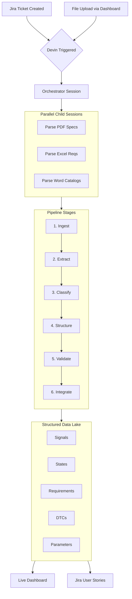

# Automotive Spec Data Lake — Continuous Ingestion Demo



> [Interactive flowchart (HTML)](docs/flowchart.html)

<details>
<summary>Flowchart (PNG fallback)</summary>


</details>

## What this demo shows

An OEM's engineering specifications — PDFs with state machine diagrams and
dense tables, Excel requirements matrices, Word signal catalogs — are spread
across unstructured formats that currently require manual Ctrl+F searching for
root cause analysis (~1 week per investigation). This demo shows Devin
**continuously** ingesting those documents into a structured data lake,
classifying and cross-referencing entities automatically, and feeding results
back into Jira as actionable user stories.

## What Devin does live

The presenter triggers a Devin session (via Jira ticket or the upload
dashboard). Devin's orchestrator session spins up **parallel child sessions** —
one per document type (PDF specs, Excel requirements, Word catalogs). Each
child parses its assigned documents through a 6-stage pipeline (Ingest →
Extract → Classify → Structure → Validate → Integrate) and writes structured
entities to the data lake. The audience watches the pipeline progress in
real-time on a localhost dashboard, sees the data lake populate with signals,
states, requirements, DTCs, and parameters, and sees Jira user stories created
for each category of findings. When a new document version drops, Devin picks
it up and re-processes — **continuous** integration of unstructured data.

## How the demo runs

**Trigger**: Jira issue with label `data-lake-ingest`, or file upload via the
dashboard at `localhost:5001`, or a Devin session prompt.

**Devin's workflow**:
1. Orchestrator session receives trigger and identifies documents to process
2. Child sessions are spawned via `devin_session_create` (one per document type)
3. Each child runs the 6-stage pipeline and writes to `data_lake/`
4. Orchestrator aggregates results and creates Jira user stories
5. Dashboard auto-refreshes to show progress and data lake contents

**Visual artifacts**:
- Upload dashboard with drag-and-drop file upload
- Real-time pipeline stage visualization
- Data lake browser (expandable categories with entry details)
- Source document viewer with embedded engineering diagrams

## Run the dashboard locally

The dashboard is a FastAPI app. From a fresh clone it runs in two commands with
[`uv`](https://docs.astral.sh/uv/) (recommended), or with plain `pip`.

### Option A — `uv` (recommended)

```bash
git clone https://github.com/tedfoley-cog/spec-data-lake-demo.git
cd spec-data-lake-demo

uv sync                                  # create venv + install dependencies
uv run uvicorn dashboard.app:app --port 5001 --reload
```

Then open **http://localhost:5001** in your browser.

### Option B — `pip` / venv

```bash
git clone https://github.com/tedfoley-cog/spec-data-lake-demo.git
cd spec-data-lake-demo

python3 -m venv .venv
source .venv/bin/activate                # Windows: .venv\Scripts\activate
pip install -e .

uvicorn dashboard.app:app --port 5001 --reload
```

### Ingestion mode: authentic Devin sessions vs. local fallback

Dropping a file behaves differently depending on whether credentials are present
in the environment running the dashboard. The nav bar shows which mode is active
(**Authentic · Devin sessions** or **Local fallback**), and the mode is also
logged at startup.

- **Authentic mode** — a dropped file is committed to a branch and a **real Devin
  session** is spawned to run the pipeline and commit structured entries back;
  the dashboard then reflects them. This requires all three:

  ```bash
  export TEDDY_SERVICE_USER_TOKEN=...   # or DEVIN_API_TOKEN  — create the session
  export TEDDY_ORG_ID=...               # or DEVIN_ORG_ID     — org-scoped v3 API
  export TEDFOLEY_COG_REPO_PAT=...      # or GITHUB_TOKEN      — push the branch
  uv run uvicorn dashboard.app:app --port 5001
  ```

- **Local fallback** — if any of the above are missing, the file is processed
  **in-process** (no Devin session is created) so the app still works offline.
  This is why a plain `localhost` run without the tokens won't spin up a session.

You can confirm the active mode any time via `GET /api/config`.

### Using the dashboard

- The data lake starts **empty**. Click **Process All Source Documents** (shown
  when the lake is empty), or **drag & drop / choose a file** in the upload panel
  to run a single document through the 6-stage pipeline and watch it populate.
- A ready-to-use demo file lives at
  `source_documents/demo/eps_control_module_spec.pdf` — a real PDF (cover page,
  state-machine diagram, and DTC / CAN-signal / calibration tables). Drop it in
  live and it is parsed with `pdfplumber` into **20 structured entries** across
  Signals, DTCs, and Parameters. Regenerate it with:

  ```bash
  uv run python scripts/generate_demo_pdf.py
  ```
- A second drop-in demo file (a different subsystem) lives at
  `source_documents/demo/bms_control_module_spec.pdf` — a High-Voltage Battery
  Management System spec (contactor state machine + DTC / CAN-signal / parameter
  tables) that also ingests to **20 structured entries**. Regenerate it with:

  ```bash
  uv run python scripts/generate_demo_pdf_bms.py
  ```
- Reset the lake to the empty "before" state at any time:

  ```bash
  rm -rf data_lake/*/  source_documents/uploads  && echo '{}' > dashboard/state.json
  ```

- Run the test suite and checks:

  ```bash
  uv run pytest -q          # 19 tests
  uv run ruff check .       # lint
  uv run mypy dashboard pipeline jira
  ```

> The dashboard updates live (polls every few seconds) — no page reload needed
> while documents are processing.

## Repo layout

```
source_documents/
  pdf_specs/
    pcm_power_modes.md + .extracted.json      # State machine spec
    transmission_shift_logic.md + .extracted.json  # Flow diagram spec
    diagrams/
      pcm_state_machine.png                   # Actual state machine diagram
      shift_logic_flow.png                    # Actual flow chart diagram
      can_bus_topology.png                    # CAN network topology
  excel/
    system_requirements.xlsx                  # Requirements matrix (13 reqs)
    test_parameters.xlsx                      # Calibration params (16 params)
  demo/
    eps_control_module_spec.pdf               # Live-upload demo PDF (real tables)
  word_docs/
    can_signal_catalog.md + .extracted.json    # 28 CAN signals
    diagnostic_dtc_matrix.md + .extracted.json # 10 DTCs

pipeline/
  ingest.py      # Stage 1: File reception + metadata
  extract.py     # Stage 2: Text, tables, diagram extraction (PDF via pdfplumber)
  classify.py    # Stage 3: Category classification
  structure.py   # Stage 4: Data lake schema conversion
  validate.py    # Stage 5: Cross-reference validation
  integrate.py   # Stage 6: Data lake write + versioning
  orchestrator.py  # Full pipeline orchestration

data_lake/       # Structured output — starts empty, Devin fills it
  signals/       # CAN signal definitions
  states/        # State machines and gear ranges
  requirements/  # Structured requirements
  dtcs/          # Diagnostic trouble codes
  parameters/    # Calibration parameters
  metadata/      # Document registry and processing history

dashboard/       # FastAPI upload UI + pipeline view + data lake browser
jira/            # Jira webhook handler + user story creation
```

## Key concepts

| Term | Description |
|------|-------------|
| **Data lake** | Structured JSON files organized by category — the "after" state of parsing |
| **Continuous ingestion** | New/updated documents are automatically processed and integrated |
| **Child sessions** | Devin spawns parallel sub-agents to process documents concurrently |
| **Pipeline stages** | 6-stage process: Ingest → Extract → Classify → Structure → Validate → Integrate |
| **Parsing complexity** | Source docs contain state machine diagrams, flow charts, dense tables |
| **Jira integration** | Triggered from Jira issues; creates user stories for findings |
