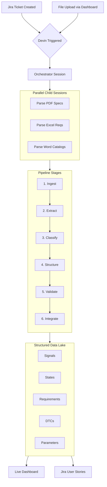
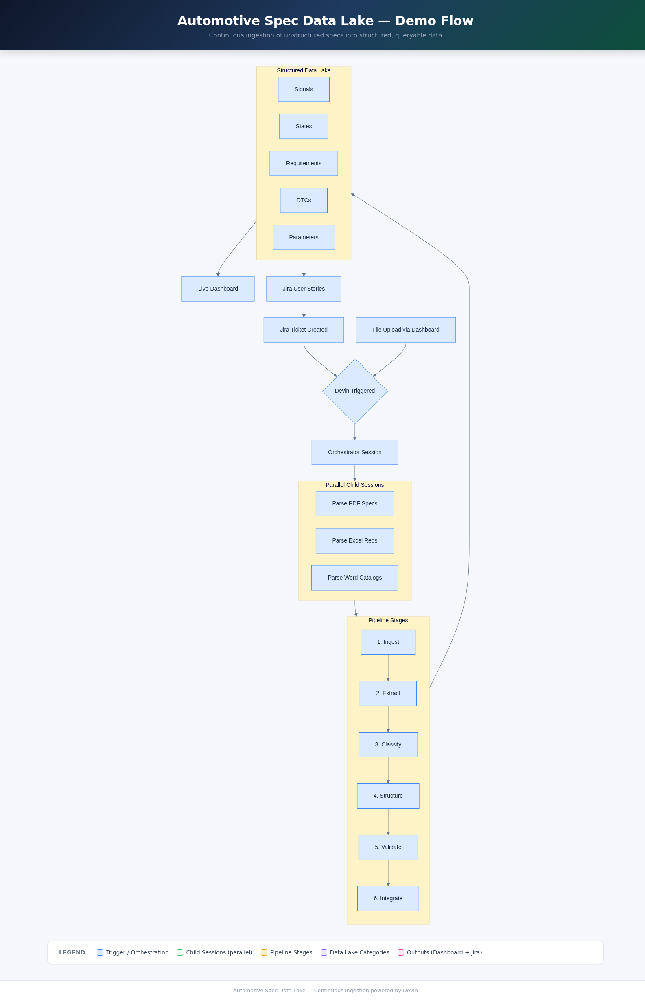

# Automotive Spec Data Lake — Continuous Ingestion Demo



> [Interactive flowchart (HTML)](docs/flowchart.html)

<details>
<summary>Flowchart (PNG fallback)</summary>


</details>

## What this demo shows

An OEM's engineering specifications — PDFs with state machine diagrams and
dense tables, Excel requirements matrices, Word signal catalogs — are spread
across unstructured formats that currently require manual Ctrl+F searching for
root cause analysis (~1 week per investigation). This demo shows Devin
**continuously** ingesting those documents into a structured data lake,
classifying and cross-referencing entities automatically, and feeding results
back into Jira as actionable user stories.

## What Devin does live

The presenter triggers a Devin session (via Jira ticket or the upload
dashboard). Devin's orchestrator session spins up **parallel child sessions** —
one per document type (PDF specs, Excel requirements, Word catalogs). Each
child parses its assigned documents through a 6-stage pipeline (Ingest →
Extract → Classify → Structure → Validate → Integrate) and writes structured
entities to the data lake. The audience watches the pipeline progress in
real-time on a localhost dashboard, sees the data lake populate with signals,
states, requirements, DTCs, and parameters, and sees Jira user stories created
for each category of findings. When a new document version drops, Devin picks
it up and re-processes — **continuous** integration of unstructured data.

## How the demo runs

**Trigger**: Jira issue with label `data-lake-ingest`, or file upload via the
dashboard at `localhost:5001`, or a Devin session prompt.

**Devin's workflow**:
1. Orchestrator session receives trigger and identifies documents to process
2. Child sessions are spawned via `devin_session_create` (one per document type)
3. Each child runs the 6-stage pipeline and writes to `data_lake/`
4. Orchestrator aggregates results and creates Jira user stories
5. Dashboard auto-refreshes to show progress and data lake contents

**Visual artifacts**:
- Upload dashboard with drag-and-drop file upload
- Real-time pipeline stage visualization
- Data lake browser (expandable categories with entry details)
- Source document viewer with embedded engineering diagrams

## Repo layout

```
source_documents/
  pdf_specs/
    pcm_power_modes.md + .extracted.json      # State machine spec
    transmission_shift_logic.md + .extracted.json  # Flow diagram spec
    diagrams/
      pcm_state_machine.png                   # Actual state machine diagram
      shift_logic_flow.png                    # Actual flow chart diagram
      can_bus_topology.png                    # CAN network topology
  excel/
    system_requirements.xlsx                  # Requirements matrix (13 reqs)
    test_parameters.xlsx                      # Calibration params (16 params)
  word_docs/
    can_signal_catalog.md + .extracted.json    # 28 CAN signals
    diagnostic_dtc_matrix.md + .extracted.json # 10 DTCs

pipeline/
  ingest.py      # Stage 1: File reception + metadata
  extract.py     # Stage 2: Text, tables, diagram extraction
  classify.py    # Stage 3: Category classification
  structure.py   # Stage 4: Data lake schema conversion
  validate.py    # Stage 5: Cross-reference validation
  integrate.py   # Stage 6: Data lake write + versioning
  orchestrator.py  # Full pipeline orchestration

data_lake/       # Structured output — starts empty, Devin fills it
  signals/       # CAN signal definitions
  states/        # State machines and gear ranges
  requirements/  # Structured requirements
  dtcs/          # Diagnostic trouble codes
  parameters/    # Calibration parameters
  metadata/      # Document registry and processing history

dashboard/       # FastAPI upload UI + pipeline view + data lake browser
jira/            # Jira webhook handler + user story creation
```

## Key concepts

| Term | Description |
|------|-------------|
| **Data lake** | Structured JSON files organized by category — the "after" state of parsing |
| **Continuous ingestion** | New/updated documents are automatically processed and integrated |
| **Child sessions** | Devin spawns parallel sub-agents to process documents concurrently |
| **Pipeline stages** | 6-stage process: Ingest → Extract → Classify → Structure → Validate → Integrate |
| **Parsing complexity** | Source docs contain state machine diagrams, flow charts, dense tables |
| **Jira integration** | Triggered from Jira issues; creates user stories for findings |
