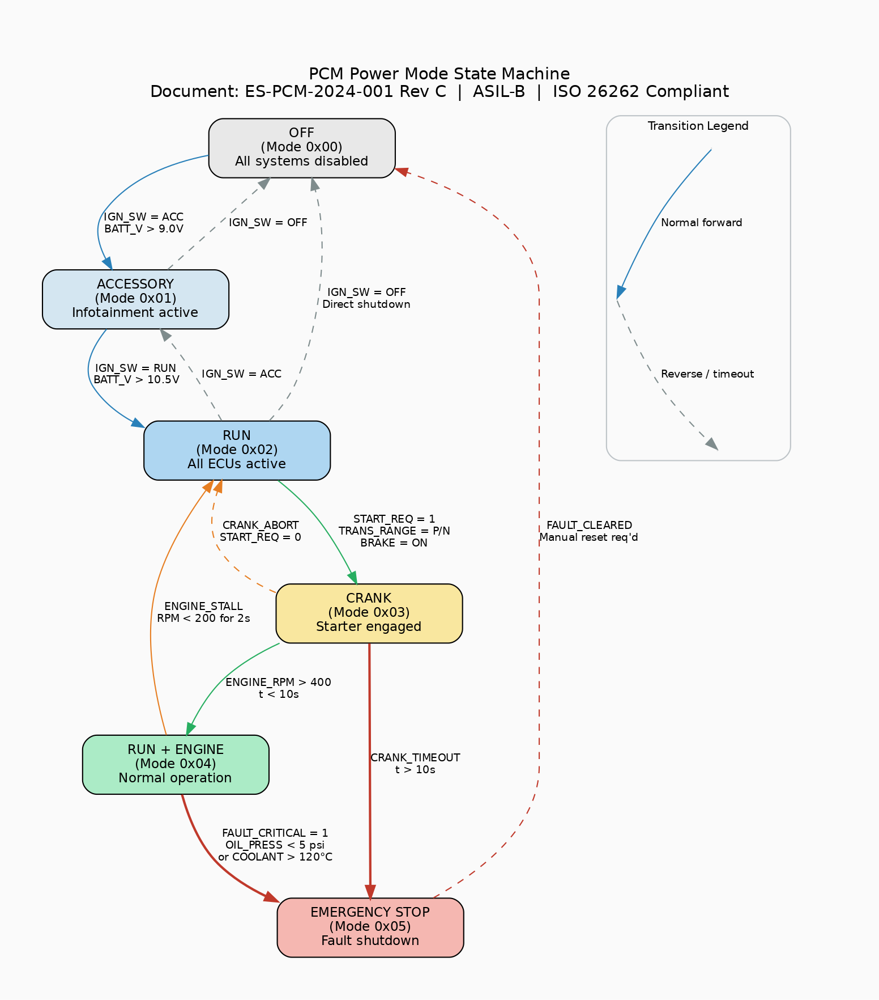

# PCM Power Mode State Machine Specification

**Document ID:** ES-PCM-2024-001  
**Revision:** C  
**Subsystem:** Powertrain Control Module  
**ASIL Rating:** ASIL-B  
**Effective Date:** 2024-03-15  
**Supersedes:** Rev B (2023-11-20)

---

## 1. Scope

This specification defines the power mode state machine for the Powertrain
Control Module (PCM). The PCM manages transitions between six discrete power
modes based on ignition switch position, battery voltage, engine RPM, and
fault conditions. All transitions must comply with ISO 26262 ASIL-B
requirements for functional safety.

## 2. State Machine Diagram

> **See Figure 1:** `diagrams/pcm_state_machine.png`
>
> The state machine diagram shows all six power modes, their entry/exit
> conditions, guard expressions, and emergency transitions. Color coding:
> - Blue arrows: normal forward transitions
> - Grey dashed arrows: reverse / timeout transitions
> - Red thick arrows: emergency transitions

## 3. Power Mode Definitions

| Mode | Code | Name | Description | Active Systems |
|------|------|------|-------------|----------------|
| 0 | 0x00 | OFF | All vehicle systems disabled | None |
| 1 | 0x01 | ACCESSORY | Infotainment and accessory power | Radio, USB, 12V outlets |
| 2 | 0x02 | RUN | All ECUs powered, engine off | All ECUs, fuel pump prime, gauges |
| 3 | 0x03 | CRANK | Starter motor engaged | Starter relay, ignition coils |
| 4 | 0x04 | RUN+ENGINE | Normal driving operation | Full powertrain, transmission |
| 5 | 0x05 | EMERGENCY STOP | Fault-triggered shutdown | Hazard lights, fuel pump shutoff |

## 4. Transition Conditions

### 4.1 Forward Transitions

| From | To | Condition | Guard | Timeout |
|------|----|-----------|-------|---------|
| OFF | ACC | IGN_SW = ACC | BATT_V > 9.0V | — |
| ACC | RUN | IGN_SW = RUN | BATT_V > 10.5V | — |
| RUN | CRANK | START_REQ = 1 | TRANS_RANGE = P or N, BRAKE = ON | — |
| CRANK | RUN+ENGINE | ENGINE_RPM > 400 | — | 10s max |

### 4.2 Reverse Transitions

| From | To | Condition | Guard |
|------|----|-----------|-------|
| RUN | ACC | IGN_SW = ACC | — |
| ACC | OFF | IGN_SW = OFF | — |
| RUN | OFF | IGN_SW = OFF | Direct shutdown permitted |
| CRANK | RUN | START_REQ = 0 | Crank abort |
| RUN+ENGINE | RUN | ENGINE_STALL | RPM < 200 for 2s |

### 4.3 Emergency Transitions

| From | To | Condition | Priority |
|------|----|-----------|----------|
| RUN+ENGINE | EMERGENCY | FAULT_CRITICAL = 1 | Highest |
| RUN+ENGINE | EMERGENCY | OIL_PRESS < 5 psi | High |
| RUN+ENGINE | EMERGENCY | COOLANT_TEMP > 120°C | High |
| CRANK | EMERGENCY | CRANK_TIMEOUT > 10s | Medium |
| EMERGENCY | OFF | FAULT_CLEARED + manual reset | — |

## 5. Signal Requirements

### 5.1 Input Signals (CAN Bus)

| Signal Name | Message ID | Bit Position | Length | Scale | Unit |
|-------------|-----------|-------------|--------|-------|------|
| IgnitionSwitch | 0x510 | 0 | 3 bits | 1 | enum |
| BatteryVoltage | 0x512 | 0 | 16 bits | 0.01 | V |
| EngineRPM | 0x120 | 0 | 16 bits | 0.25 | rpm |
| StartRequest | 0x511 | 0 | 1 bit | 1 | bool |
| TransRange | 0x210 | 4 | 4 bits | 1 | enum |
| BrakePedal | 0x310 | 0 | 1 bit | 1 | bool |
| OilPressure | 0x122 | 0 | 8 bits | 0.5 | psi |
| CoolantTemp | 0x123 | 0 | 8 bits | 1 | °C |
| FaultCritical | 0x7F0 | 0 | 1 bit | 1 | bool |

### 5.2 Output Signals (CAN Bus)

| Signal Name | Message ID | Bit Position | Length | Scale | Unit |
|-------------|-----------|-------------|--------|-------|------|
| PowerModeState | 0x130 | 0 | 8 bits | 1 | enum |
| StarterRelay | 0x131 | 0 | 1 bit | 1 | bool |
| FuelPumpRelay | 0x131 | 1 | 1 bit | 1 | bool |
| IgnitionCoilEn | 0x131 | 2 | 1 bit | 1 | bool |

## 6. Diagnostic Trouble Codes

| DTC | Description | Enable Condition | MIL |
|-----|-------------|-----------------|-----|
| P0335 | Crankshaft Position Sensor | RUN+ENGINE, RPM = 0 for 5s | Yes |
| P0562 | System Voltage Low | Any mode, BATT_V < 9.0V for 30s | Yes |
| P0563 | System Voltage High | Any mode, BATT_V > 16.0V for 10s | Yes |
| P0602 | PCM Calibration Error | Power-on self-test | Yes |
| U0100 | Lost Communication with ECM | RUN or RUN+ENGINE, no msg for 1s | Yes |

## 7. Revision History

| Rev | Date | Author | Changes |
|-----|------|--------|---------|
| A | 2023-06-01 | Systems Engineering | Initial release |
| B | 2023-11-20 | Systems Engineering | Added emergency stop transitions |
| C | 2024-03-15 | Systems Engineering | Updated voltage thresholds per field data |
