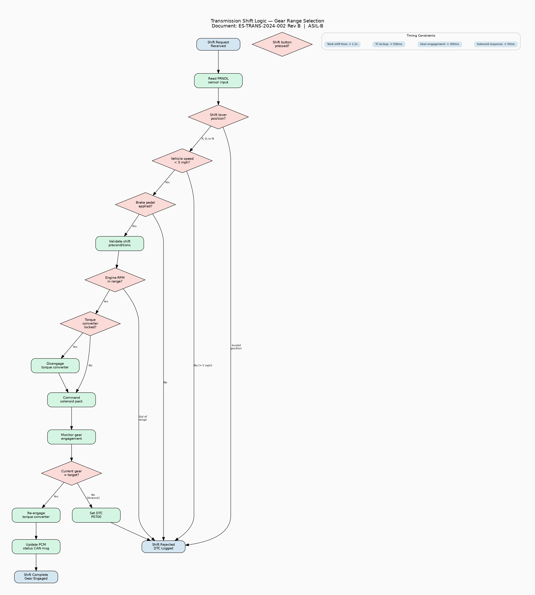

# Transmission Shift Logic — Gear Range Selection

**Document ID:** ES-TRANS-2024-002  
**Revision:** B  
**Subsystem:** Transmission Control Module  
**ASIL Rating:** ASIL-B  
**Effective Date:** 2024-02-01

---

## 1. Scope

This specification defines the gear range selection logic for the automatic
transmission control module (TCM). The shift logic governs transitions between
Park (P), Reverse (R), Neutral (N), and Drive (D) ranges, including all
safety interlocks and timing constraints.

## 2. Shift Logic Flow Diagram

> **See Figure 1:** `diagrams/shift_logic_flow.png`
>
> The flow diagram shows the complete decision tree for processing a gear
> shift request, from PRNDL sensor reading through solenoid actuation to
> final gear engagement verification. Decision diamonds show conditional
> branching; green boxes show processing steps.

## 3. Gear Range Definitions

| Range | Code | Description | Allowed From |
|-------|------|-------------|--------------|
| P | 0x00 | Park — transmission locked, output shaft engaged | R, N (vehicle stopped) |
| R | 0x01 | Reverse — reverse gear engaged | P, N (brake + speed < 5 mph) |
| N | 0x02 | Neutral — transmission disengaged | P, R, D |
| D | 0x03 | Drive — automatic gear selection (1-10) | N (brake applied) |

## 4. Shift Preconditions

### 4.1 Safety Interlocks

| Shift | Precondition | Failure Action |
|-------|-------------|----------------|
| Any → R | Vehicle speed < 5 mph AND brake applied | Reject shift, set DTC P0700 |
| Any → P | Vehicle speed < 3 mph | Reject shift, set DTC P0700 |
| N → D | Brake pedal applied | Reject shift, set DTC P0705 |
| P → R | Brake pedal applied AND shift button pressed | Reject shift |
| Any | Engine RPM within shift calibration range | Reject shift, set DTC P0730 |

### 4.2 Timing Constraints

| Parameter | Value | Notes |
|-----------|-------|-------|
| Solenoid response time | < 50 ms | From command to actuation |
| Gear engagement time | < 300 ms | Mechanical engagement verification |
| Torque converter lockup | < 500 ms | After gear engagement |
| Total shift time | < 1.2 s | End-to-end shift duration |
| Shift quality window | ±0.3 g | Maximum acceleration discontinuity |

## 5. Shift Schedule — Drive Mode

### 5.1 Upshift Points (Normal Mode)

| Gear Change | Throttle 0-25% | Throttle 25-50% | Throttle 50-75% | Throttle 75-100% |
|------------|----------------|-----------------|-----------------|-------------------|
| 1 → 2 | 15 mph | 22 mph | 30 mph | 42 mph |
| 2 → 3 | 25 mph | 32 mph | 42 mph | 55 mph |
| 3 → 4 | 35 mph | 42 mph | 52 mph | 65 mph |
| 4 → 5 | 42 mph | 50 mph | 60 mph | 75 mph |
| 5 → 6 | 48 mph | 55 mph | 65 mph | 80 mph |
| 6 → 7 | 52 mph | 60 mph | 72 mph | 90 mph |
| 7 → 8 | 58 mph | 65 mph | 78 mph | 100 mph |
| 8 → 9 | 62 mph | 70 mph | 85 mph | 110 mph |
| 9 → 10 | 68 mph | 75 mph | 90 mph | 120 mph |

### 5.2 Downshift Points (Normal Mode)

| Gear Change | Throttle 0-25% | Throttle 25-50% | Throttle 50-75% | Throttle 75-100% |
|------------|----------------|-----------------|-----------------|-------------------|
| 10 → 9 | 60 mph | 68 mph | 80 mph | 110 mph |
| 9 → 8 | 55 mph | 62 mph | 75 mph | 100 mph |
| 8 → 7 | 50 mph | 58 mph | 70 mph | 90 mph |
| 7 → 6 | 45 mph | 52 mph | 65 mph | 80 mph |
| 6 → 5 | 40 mph | 48 mph | 58 mph | 72 mph |
| 5 → 4 | 35 mph | 42 mph | 50 mph | 65 mph |
| 4 → 3 | 28 mph | 35 mph | 42 mph | 55 mph |
| 3 → 2 | 18 mph | 25 mph | 32 mph | 42 mph |
| 2 → 1 | 10 mph | 15 mph | 22 mph | 30 mph |

## 6. CAN Bus Interface

| Signal Name | Message ID | Description |
|-------------|-----------|-------------|
| ShiftLeverPosition | 0x211 | Current PRNDL sensor reading |
| CurrentGear | 0x210 | Active gear (0-10) |
| TargetGear | 0x212 | Commanded gear |
| ShiftInProgress | 0x213 | Shift active flag |
| TorqueConverterState | 0x214 | TC lockup status |
| ShiftSolenoidCmd | 0x220 | Solenoid pack command |
| ShiftQuality | 0x215 | Last shift quality metric |

## 7. Revision History

| Rev | Date | Author | Changes |
|-----|------|--------|---------|
| A | 2023-09-01 | Transmission Calibration | Initial release |
| B | 2024-02-01 | Transmission Calibration | Added 10-speed schedule, updated timing |
